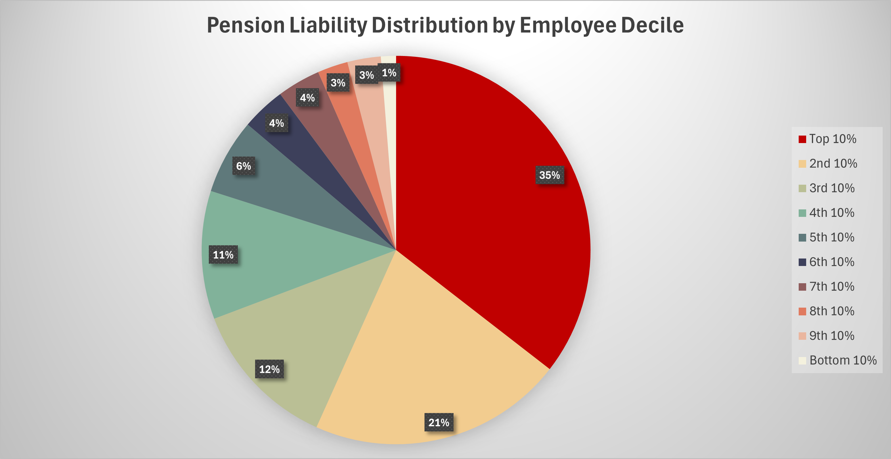
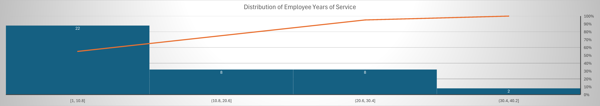
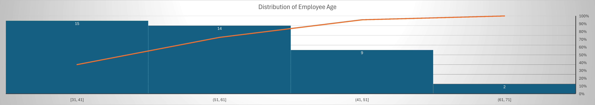
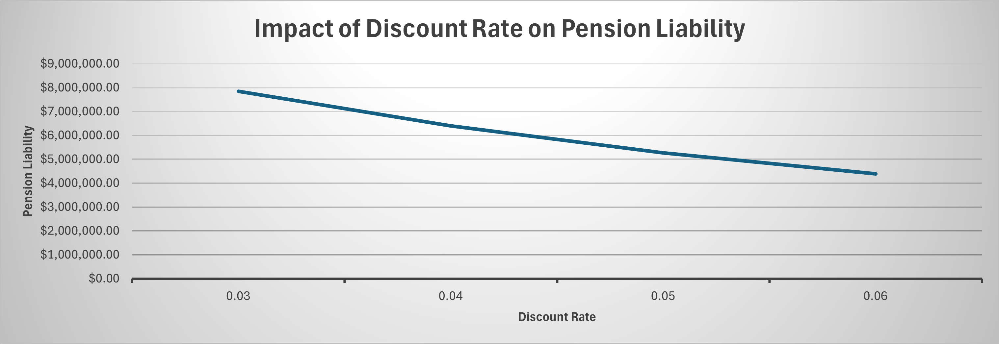
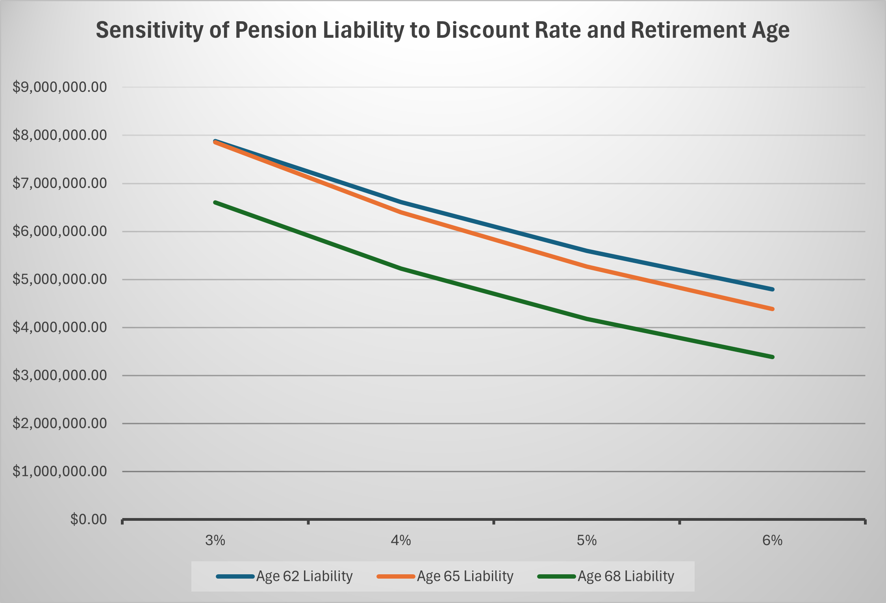

# Pension Liability Forecasting Sensitivity Modeling

This project simulates a defined benefit pension plan and analyzes how total liabilities vary based on changes in discount rate and retirement age. Using Excel, I built a dynamic pension model for 40 employees and visualized liability exposure and concentration across multiple actuarial scenarios.

---

## Key Features

- **Defined Benefit Modeling**: Calculated annual pension payouts using salary, years of service, and a fixed multiplier
- **Present Value Forecasting**: Applied annuity formulas with variable discount rates (3%–6%) and retirement ages (62, 65, 68)
- **Sensitivity Analysis**: Quantified how small changes in assumptions impact total plan liabilities
- **Risk Concentration Insights**: Identified that the top 10% of employees held 35% of all pension liability

---

## Visualizations

- **Pension Liability Distribution by Employee Decile**  
  

- **Distribution of Employee Years of Service**  
  

- **Distribution of Employee Age**  
  

- **Impact of Discount Rate on Pension Liability**  
  

- **Sensitivity of Pension Liability to Discount Rate and Retirement Age**  
  

---

## Tools Used
- Excel (data tables, PV formulas, charts)
- Annuity Present Value Calculations
- Structured modeling using assumptions and scenario testing

---

## Outcomes
- Automated liability forecasting across 12 scenarios
- Identified up to 33% swing in total liabilities based on rate and age inputs
- Created reporting-style visuals for executive-level interpretation

---

